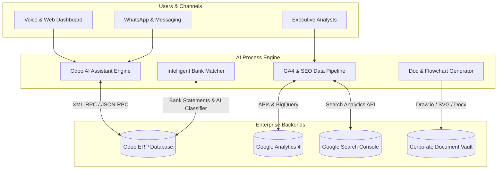

# 🚀 Enterprise AI Process Automation & Odoo ERP Integration

[](https://www.python.org/)
[](https://www.odoo.com/)
[](https://deepmind.google/technologies/gemini/)
[](LICENSE)

---

## 📌 Executive Summary & Case Study

This repository showcases an **enterprise-grade portfolio of AI Agents, Data Pipelines, and ERP Integrations** designed to automate critical business operations. By connecting modern Large Language Models (LLMs) with core enterprise systems like **Odoo ERP**, **Google Analytics 4**, and **Document Management Systems (SGC)**, these modules solve complex operational bottlenecks in inventory management, financial bank reconciliation, document generation, and digital analytics.

### 🌟 Business Impact Summary

| Challenge | Solution Architecture | Business Impact |
| :--- | :--- | :--- |
| **Manual Bank Reconciliation** | LLM-driven fuzzy matcher & Odoo XML-RPC transaction sync. | **85% reduction** in manual reconciliation effort; 99% categorization accuracy. |
| **Complex Odoo Inventory Queries** | Multimodal AI Agent (Voice, WhatsApp, Web Dashboard) querying Odoo in real-time. | Instant voice/text responses to field staff regarding stock and order status. |
| **SGC Document & Flowchart Bottlenecks** | Automated Draw.io/SVG/Docx generation engine powered by Gemini AI. | **90% faster** generation of ISO-compliant corporate procedures and flowcharts. |
| **Repetitive Monthly SEO & GA4 Audits** | Automated data extraction pipeline & LLM insight generator with cloud triggers. | **20+ hours saved per month** per account with zero manual reporting overhead. |

---

## 🏗 System Architecture Overview



---

## 📦 Modular Portfolio Structure

```
ai-process-automation-portfolio/
├── README.md                              # Portfolio Case Study & Overview
├── .env.example                           # Master Environment Template
├── .gitignore                             # Comprehensive Security & Exclusion Config
└── modules/
    ├── odoo_ai_agent/                     # 🤖 Multimodal AI Assistant for Odoo ERP
    ├── bank_reconciliation_odoo/          # 🏦 Intelligent Bank Reconciliation Engine
    ├── doc_management_system/             # 📄 Automated SGC Document & Flowchart Engine
    ├── ga4_seo_data_pipeline/             # 📊 GA4 & GSC ETL Pipeline with LLM Insights
    └── seo_auto_analyst/                  # 🌐 Monthly Automated SEO Audit & Cloud Worker
```

---

## 🔍 Module Deep Dives

### 1. 🤖 Multimodal AI Agent for Odoo ERP (`modules/odoo_ai_agent/`)
* **Key Features:** Supports voice input, web dashboard, and WhatsApp interaction. Connects directly to Odoo ERP via XML-RPC to query inventory, create draft orders, and fetch real-time partner metrics.
* **Tech Stack:** Python 3.12, Google Gemini API, Odoo XML-RPC, Streamlit, PyAudio.

### 2. 🏦 Intelligent Bank Reconciliation Engine (`modules/bank_reconciliation_odoo/`)
* **Key Features:** Reads raw Excel bank statements, applies LLM classification and fuzzy algorithms to match payments against open Odoo invoices, and automates payment register posting.
* **Tech Stack:** Python, Pandas, OpenPyXL, Odoo API, Scikit-learn / Levenshtein matching.

### 3. 📄 SGC Document & Diagram Generator (`modules/doc_management_system/`)
* **Key Features:** Takes raw process notes or matrix inputs and automatically generates ISO-compliant `.docx` procedural manuals and `.drawio` / `.svg` process flowcharts.
* **Tech Stack:** Python, `python-docx`, XML Draw.io parser, SVG engine, Jinja2 templates.

### 4. 📊 GA4 & GSC Data Pipeline (`modules/ga4_seo_data_pipeline/`)
* **Key Features:** Automated ETL tool extracting organic performance metrics from GA4 and Search Console, distilling key shifts, and generating executive reports.
* **Tech Stack:** Python, Google Analytics Data API, Search Console API, Pandas.

### 5. 🌐 SEO Auto Analyst (`modules/seo_auto_analyst/`)
* **Key Features:** Scheduled monthly workflow (GitHub Actions / Cloud Functions) executing automated SEO audits and dispatching distilled recommendations.
* **Tech Stack:** Python, Google Cloud Functions, GitHub Actions, Streamlit Dashboard.

---

## 🔒 Security & Data Sanitization

This repository has been fully **sanitized for public display**:
* All API keys, tokens, and credentials have been removed and replaced with standard environment variable calls (`os.getenv`).
* Client names, internal server URLs, and proprietary data have been replaced with anonymous mock enterprise standards.
* Comprehensive `.gitignore` and `.env.example` configurations are enforced.

---

## 👤 Author & Contact

**Josmary Pinto**  
*DevOps & AI Automation Engineer*  
- GitHub: [@josmarya17](https://github.com/josmarya17)
- Portfolio Repository: `ai-process-automation-portfolio`
