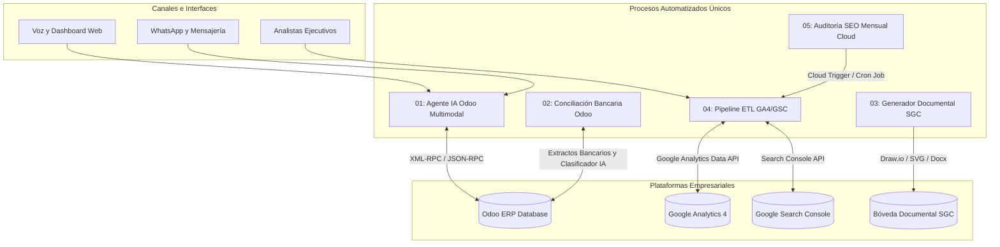

# 🚀 Portafolio de Automatización de Procesos con IA e Integración Odoo ERP

[](https://www.python.org/)
[](https://www.odoo.com/)
[](https://deepmind.google/technologies/gemini/)
[](LICENSE)

---

## 📌 Resumen Ejecutivo y Caso de Estudio

Este repositorio reúne un **portafolio de automatizaciones de procesos empresariales independientes**, diseñados para resolver cuellos de botella operativos mediante la combinación de **Inteligencia Artificial Generativa (LLMs)**, **integración con Odoo ERP**, **gestión documental automatizada (SGC)** y **pipelines de analítica digital**.

Cada carpeta contenida dentro del directorio [`processes/`](processes/) representa un **proceso automatizado único e independiente**, equipado con su propio código fuente, entorno de ejecución, plantillas de configuración y documentación técnica dedicada.

---

## 📂 Contenido del Repositorio y Descripción de Carpetas

A continuación se detalla la estructura y el propósito de cada una de las carpetas de procesos que conforman este portafolio:

```
ai-process-automation-portfolio/
├── README.md                              # Documentación Principal del Portafolio en Español
├── .gitignore                             # Reglas de seguridad y exclusión de archivos
├── .env.example                           # Plantilla maestra de variables de entorno
└── processes/                             # Directorio de Procesos Automatizados Únicos
    ├── 01_agente_ia_odoo_multimodal/      # 🤖 Asistente Multimodal (Voz, WhatsApp, Web) para Odoo ERP
    ├── 02_conciliacion_bancaria_odoo/     # 🏦 Motor de Conciliación Bancaria Automática con Odoo ERP
    ├── 03_gestion_documental_sgc/         # 📄 Sistema de Generación Documental y Flujogramas SGC
    ├── 04_pipeline_etl_ga4_gsc/           # 📊 Pipeline ETL de Analítica Web (GA4 y Search Console)
    └── 05_auditoria_seo_mensual_cloud/    # 🌐 Auditoría SEO Mensual Automatizada y Workers Cloud
```

---

### 🔍 Detalle de cada Carpeta de Proceso Automatizado

#### 🤖 1. [`processes/01_agente_ia_odoo_multimodal/`](processes/01_agente_ia_odoo_multimodal/)
- **¿Qué contiene?**: Código fuente completo del asistente virtual multimodal que interactúa en tiempo real con **Odoo ERP** mediante la API XML-RPC. Incluye interfaz de voz (Speech-to-Text), dashboard web en Streamlit y conector de mensajería (WhatsApp).
- **Caso de uso**: Permite a personal de campo y ejecutivos consultar niveles de inventario, validar estatus de pedidos de venta y datos de clientes usando lenguaje natural por voz o texto.

#### 🏦 2. [`processes/02_conciliacion_bancaria_odoo/`](processes/02_conciliacion_bancaria_odoo/)
- **¿Qué contiene?**: Algoritmos de coincidencia difusa (*Fuzzy Matching*) y clasificadores con IA para procesar extractos bancarios masivos en formatos Excel (`.xlsx`) y CSV, vinculándolos automáticamente con las facturas abiertas en Odoo ERP.
- **Caso de uso**: Automatiza la conciliación de cobros y pagos bancarios, reduciendo en un **85% el trabajo manual** del equipo contable.

#### 📄 3. [`processes/03_gestion_documental_sgc/`](processes/03_gestion_documental_sgc/)
- **¿Qué contiene?**: Motor de generación documental enfocado en Sistemas de Gestión de Calidad (SGC / ISO). Incluye scripts para construir flujogramas visuales en formato Draw.io (`.drawio`), exportación vectorial SVG y creación de manuales de procedimientos en Word (`.docx`).
- **Caso de uso**: Genera automáticamente procedimientos corporativos normalizados y diagramas de procesos a partir de matrices de datos e instrucciones en lenguaje natural.

#### 📊 4. [`processes/04_pipeline_etl_ga4_gsc/`](processes/04_pipeline_etl_ga4_gsc/)
- **¿Qué contiene?**: Pipeline de extracción de datos (ETL) que se conecta con **Google Analytics 4 (GA4)** y **Google Search Console (GSC)**, realiza limpieza de métricas orgánicas y genera resúmenes analíticos mediante IA.
- **Caso de uso**: Automatiza la consolidación de clics, impresiones, conversiones y comportamiento de usuarios, ahorrando **20+ horas al mes** en analítica web.

#### 🌐 5. [`processes/05_auditoria_seo_mensual_cloud/`](processes/05_auditoria_seo_mensual_cloud/)
- **¿Qué contiene?**: Módulo de auditoría periódica configurado para ejecutarse mediante **GitHub Actions** o **Google Cloud Functions**. Incluye verificadores de indexabilidad, salud técnica del sitio y un dashboard Streamlit para visualizar históricos.
- **Caso de uso**: Ejecuta diagnósticos SEO automáticos cada mes y notifica hallazgos críticos sin intervención humana.

---

## 🌟 Tabla de Impacto y Valor de Negocio

| Proceso Automatizado Único | Solución Tecnológica | Impacto de Negocio Generado |
| :--- | :--- | :--- |
| **01. Agente IA Odoo Multimodal** | Voz + WhatsApp + XML-RPC Odoo API | Consultas de inventario y pedidos con **80% menos tiempo de respuesta**. |
| **02. Conciliación Bancaria Odoo** | Fuzzy Matching + Clasificador LLM | **85% de reducción** en conciliación contable manual y 99% de precisión. |
| **03. Gestión Documental SGC** | Draw.io XML + Render SVG + Docx ISO | **90% más rápido** en creación de procedimientos y diagramas de flujo. |
| **04. Pipeline ETL GA4 & GSC** | Google Analytics Data API + Insights LLM | **20+ horas ahorradas/mes** en elaboración de reportes de analítica orgánicos. |
| **05. Auditoría SEO Cloud** | GitHub Actions Cron + Cloud Functions | Diagnóstico y monitoreo técnico SEO 100% automatizado sin costo operativo. |

---

## 🏗 Arquitectura del Sistema



---

## 🔒 Seguridad y Sanitización

Este proyecto cumple con estándares estrictos de **seguridad y sanitización**:
- **0 Credenciales Expuestas**: Se eliminaron todas las claves API, tokens y contraseñas.
- **Anonimización Corporativa**: Se reemplazaron los nombres reales de empresas clientes por estándares corporativos de prueba.
- **Archivos de Configuración**: Se incluyen plantillas `.env.example` y un `.gitignore` exhaustivo.

---

## 👤 Autora y Contacto

**Josmary Pinto**  
*DevOps & AI Automation Engineer*  
- GitHub: [@josmarya17](https://github.com/josmarya17)
- Repositorio: `ai-process-automation-portfolio`
