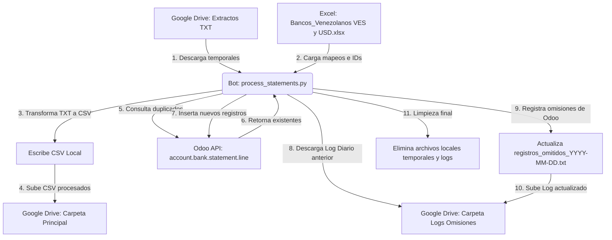

# Manual de Operación y Despliegue en Producción - Integración Bancaria (Odoo & Google Drive)

Este documento describe la arquitectura, el funcionamiento interno y el procedimiento detallado para migrar, configurar y automatizar el procesador de extractos bancarios en el entorno de producción (AWS).

---

## 1. Arquitectura y Flujo de Operación

El bot realiza un flujo de integración continuo y automatizado en cada ejecución:



### Detalle de Procesamiento y Deduplicación:
* **Firma de Importes**: Dependiendo de si la columna `Clase de Movimiento` en el archivo `.txt` original indica `ND` (Nota de Débito) o `NC` (Nota de Crédito), o si tiene códigos/tokens específicos parametrizados en `config.json`, el importe se firma de manera correspondiente (negativo para débitos, positivo para créditos).
* **Control de Duplicados**: Antes de escribir en Odoo, el script realiza una búsqueda en lote (`search_read`) para consultar si en Odoo ya existen líneas del modelo `account.bank.statement.line` que coincidan con `journal_id`, `date`, `ref` y `amount` (redondeado a dos decimales).
* **Logs Diarios**: Si existen registros duplicados en el lote, se omiten y se escriben en un log que lleva por nombre la fecha de ejecución: `registros_omitidos_YYYY-MM-DD.txt`.

---

## 2. Archivos del Proyecto

El directorio raíz de la aplicación contiene:

* **[process_statements.py](file:///c:/Users/Sist-JPinto/Desktop/integracion_bancaria/process_statements.py)**: Código principal en Python que orquesta las llamadas a la API de Google Drive y la API de Odoo.
* **[config.json](file:///c:/Users/Sist-JPinto/Desktop/integracion_bancaria/config.json)**: Archivo de configuración que contiene las credenciales de Odoo, tokens de firma de importes, IDs de carpetas de Drive y parámetros de filtro.
* **[Bancos_Venezolanos VES y USD.xlsx](file:///c:/Users/Sist-JPinto/Desktop/integracion_bancaria/Bancos_Venezolanos VES y USD.xlsx)**: Hoja de cálculo de mapeo entre códigos de bancos (TXT) y diarios contables de Odoo con sus respectivos IDs numéricos en base de datos.
* **`credentials.json`**: Credenciales de cliente OAuth 2.0 descargadas de Google Cloud Console.
* **`token.json`**: Token de acceso OAuth 2.0 persistido. Evita tener que autenticarse manualmente tras la primera autorización.
* **[run_process.bat](file:///c:/Users/Sist-JPinto/Desktop/integracion_bancaria/run_process.bat)**: Script lanzador para entornos Windows.

---

## 3. Preparación del Entorno en AWS

Dependiendo del sistema operativo que utilicen en la instancia de AWS (Windows Server o Linux/Ubuntu), se deben configurar los requisitos previos.

### A. Si la instancia AWS es Linux (EC2 / Ubuntu)
1. Instalar Python 3.10 o superior:
   ```bash
   sudo apt update
   sudo apt install -y python3 python3-pip python3-venv
   ```
2. Crear un entorno virtual dentro de la carpeta del proyecto:
   ```bash
   python3 -m venv venv
   source venv/bin/activate
   ```
3. Instalar las dependencias de Python:
   ```bash
   pip install --upgrade pip
   pip install google-api-python-client google-auth-httplib2 google-auth-oauthlib openpyxl
   ```
4. Crear un script shell ejecutable para automatización (similar a `run_process.sh`):
   ```bash
   #!/bin/bash
   cd /ruta/a/integracion_bancaria
   source venv/bin/activate
   python3 process_statements.py >> run_execution.log 2>&1
   ```
   Hacerlo ejecutable: `chmod +x run_process.sh`

### B. Si la instancia AWS es Windows Server
1. Descargar e instalar Python 3.10+ para Windows. Asegurarse de marcar la casilla **"Add Python to PATH"** en el instalador.
2. Abrir la terminal (PowerShell o CMD) en la carpeta del proyecto e instalar las dependencias:
   ```powershell
   pip install google-api-python-client google-auth-httplib2 google-auth-oauthlib openpyxl
   ```
3. Puedes utilizar el archivo `run_process.bat` existente para ejecutar el bot.

---

## 4. Pasos para Lanzamiento a Producción

Sigue este checklist secuencial al mover la aplicación al entorno productivo:

### Paso 1: Configurar carpetas compartidas de Google Drive
El bot de producción leerá y escribirá en las carpetas oficiales del negocio.
1. En Google Drive, obtén el **ID de la carpeta principal** (donde el RPA deposita los archivos `.txt`).
   * *Ejemplo extraído de la URL*: `https://drive.google.com/drive/folders/ID_CARPETA_PRINCIPAL`
2. Obtén el **ID de la carpeta compartida de logs de omisiones** (donde se guardarán los logs diarios de registros omitidos).
3. Abre `config.json` en la instancia de AWS y actualiza las claves:
   ```json
   "google_drive_folder_id": "ID_CARPETA_PRINCIPAL_PRODUCCION",
   "google_drive_omitted_folder_id": "ID_CARPETA_LOGS_PRODUCCION",
   ```

### Paso 2: Autenticación con Google API (OAuth 2.0)
Al cambiar de servidor o de cuenta de Google Workspace en producción:
1. Copia tu archivo `credentials.json` a la carpeta del proyecto en la instancia AWS.
2. Si deseas reutilizar el token actual sin abrir el navegador en producción:
   * Copia el archivo `token.json` generado localmente a la carpeta del proyecto en AWS. Al tener los mismos permisos de acceso de Drive, funcionará directamente sin interactuar.
3. Si prefieres autorizar nuevamente desde producción (requiere navegador o redirección):
   * Borra `token.json` en AWS.
   * Ejecuta `python process_statements.py` manualmente por primera vez. El script abrirá el navegador para autorizar la cuenta de Google y generará un nuevo `token.json` definitivo.

### Paso 3: Configurar credenciales de Odoo de Producción
Modifica la sección `"odoo"` en `config.json` para conectarte a la base de datos de producción:
```json
"odoo": {
  "url": "https://su-instancia-odoo.com",
  "db": "nombre-base-de-datos-produccion",
  "user": "usuario-administrador-o-servicio@Empresa Demo.com",
  "password": "CLAVE_DE_ACCESO_O_API_KEY_PRODUCTIVO"
}
```
> [!TIP]
> **API Keys en Odoo**: Por seguridad, en lugar de utilizar la contraseña de usuario en texto plano en `config.json`, ingresa a Odoo Productivo > Perfil de Usuario > Seguridad > Claves API, genera una clave nueva y úsala en el campo `"password"`.

### Paso 4: Mapear Diarios e IDs Contables en Odoo de Producción
Al cambiar a la base de datos de producción, los IDs internos (`id`) de los diarios contables contables en Odoo **cambiarán**. Si conservas los de prueba, el script insertará registros en diarios incorrectos o fallará.
1. Abre Odoo de Producción y ve a **Contabilidad > Configuración > Diarios contables**.
2. Identifica los diarios de bancos nacionales y en divisa extranjera (VES y USD) que corresponden a los códigos del archivo de texto.
3. Consigue el ID numérico de cada diario (puedes activar el modo desarrollador en Odoo y ver el ID en la URL de configuración del diario, o exportar la lista de diarios incluyendo el campo `External ID` o `Database ID`).
4. Abre `Bancos_Venezolanos VES y USD.xlsx` en producción y actualiza la columna **`ID`** (generalmente la última columna) de cada banco en las hojas `VES` y `USD` con los IDs reales de Odoo Productivo.

### Paso 5: Activar el Filtro de Fecha de Ejecución
En desarrollo manteníamos `"filter_by_date": false` para procesar archivos históricos sin importar su fecha. En producción, **esto debe revertirse para evitar procesar archivos antiguos cada día**:
1. En `config.json`, cambia el valor:
   ```json
   "filter_by_date": true
   ```
2. Esto asegura que el script solo filtre y procese aquellos archivos de texto cuyos nombres o fechas de modificación coincidan con **hoy** o **ayer**.

---

## 5. Automatización del Proceso (Programador)

Para que el bot se ejecute de manera desasistida diariamente:

### En Windows Server (Task Scheduler)
1. Abre el **Programador de Tareas** y crea una tarea básica.
2. Configura el disparador (Trigger) para que corra diariamente a la hora deseada (ej. `07:00 AM`).
3. En la acción, selecciona **"Iniciar un programa"**.
4. Apunta al archivo script: `C:\ruta\integracion_bancaria\run_process.bat`
5. Agrega el argumento: `--scheduled`
   * *Nota*: Este argumento evita que el archivo `.bat` se quede pausado al final con el mensaje "Presione cualquier tecla para continuar...".
6. Configura para que se ejecute tanto si el usuario ha iniciado sesión como si no.

### En Linux (Cron)
1. Abre el editor de tareas programadas de cron:
   ```bash
   crontab -e
   ```
2. Agrega una línea para programar la ejecución todos los días a las 7:00 AM:
   ```text
   0 7 * * * /ruta/a/integracion_bancaria/run_process.sh
   ```
3. Guarda y cierra. Cron ejecutará el script de forma autónoma.
