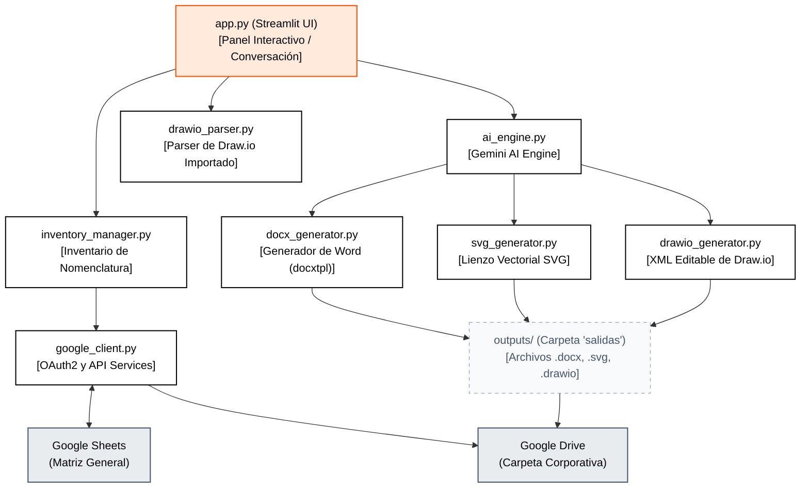

# Manual Técnico y Guía de Despliegue en la Nube
## Proyecto: Enterprise SGC BPM Automator (Sistema de Gestión Documental y Automatización de Procesos)

Este documento proporciona una descripción detallada de la arquitectura, componentes, funcionamiento y flujo de trabajo de **Enterprise SGC BPM Automator**, así como los pasos e instrucciones técnicas necesarias para su despliegue y operación en un entorno de nube (producción).

---

## Índice
1. [Introducción y Propósito del Proyecto](#1-introducción-y-propósito-del-proyecto)
2. [Arquitectura General del Sistema](#2-arquitectura-general-del-sistema)
3. [Estructura del Proyecto y Módulos de Código](#3-estructura-del-proyecto-y-módulos-de-código)
4. [Funcionamiento y Flujo de Trabajo Detallado](#4-funcionamiento-y-flujo-de-trabajo-detallado)
5. [Configuración y Ejecución Local](#5-configuración-y-ejecución-local)
6. [Guía de Despliegue en la Nube (Producción)](#6-guía-de-despliegue-en-la-nube-producción)
   - [Opciones de Hosting Recomendadas](#opciones-de-hosting-recomendadas)
   - [El Desafío de la Autenticación con Google APIs en Servidores Nube](#el-desafío-de-la-autenticación-con-google-apis-en-servidores-nube)
   - [Solución A: Despliegue con Cuenta de Servicio (Recomendada para Producción)](#solución-a-despliegue-con-cuenta-de-servicio-recomendada-para-producción)
   - [Solución B: Persistencia de token.json (Para OAuth de Usuario)](#solución-b-persistencia-de-tokenjson-para-oauth-de-usuario)
   - [Despliegue Paso a Paso en Google Cloud Run](#despliegue-paso-a-paso-en-google-cloud-run)
   - [Despliegue Paso a Paso en Streamlit Community Cloud](#despliegue-paso-a-paso-en-streamlit-community-cloud)

---

## 1. Introducción y Propósito del Proyecto

**Enterprise SGC BPM Automator** es una herramienta web interactiva diseñada para la optimización y estandarización documental en **Farmacia Enterprise SGC**. Su propósito principal es automatizar el levantamiento, diseño y formalización de procesos de negocio corporativos, transformando apuntes informales, minutas de reuniones, PDFs o diagramas de flujo existentes en estándares rigurosos de control de calidad.

### Problemas que Resuelve:
* **Consumo de tiempo en redacción:** Traducir apuntes sueltos en manuales o procedimientos formales de calidad solía requerir horas de redacción manual.
* **Inconsistencia estética y de contenido:** Dificultad para mantener una nomenclatura unificada (códigos de documentos) y formatos de flujograma homogéneos.
* **Desconexión entre diagramas y documentos:** Los flujogramas dibujados en herramientas de terceros raramente coincidían con las descripciones textuales del procedimiento escrito.

### Solución Ofrecida:
* **Redactor de Procesos con IA:** Un chatbot interactivo ("Enterprise SGC Procesos IA") alimentado por Gemini que entiende las notas y refina los pasos con el usuario.
* **Importación y Análisis de Draw.io:** Capacidad para parsear diagramas de flujo de Draw.io (`.drawio`) y auto-redactar todo el manual formal asociado.
* **Generación de Entregables Profesionales Duales:**
  1. Un documento de Word (`.docx`) formateado con los cajetines y secciones oficiales (Objetivo, Alcance, Normas, Pasos Detallados, Glosario) listo para descargar.
  2. Un diagrama de carriles de responsabilidades estilo Figma, exportable como imagen SVG vectorial de alta resolución y como archivo editable `.drawio`.
* **Sincronización en la Nube:** Asignación inteligente y secuencial de la nomenclatura documental y registro directo de nuevos documentos en una matriz centralizada en Google Sheets y Google Drive.

---

## 2. Arquitectura General del Sistema

El sistema sigue una arquitectura modular en Python utilizando **Streamlit** como la interfaz interactiva frontend y un núcleo de servicios especializados (helpers) para la comunicación con modelos de lenguaje y generación de archivos:



---

## 3. Estructura del Proyecto y Módulos de Código

A continuación se detalla la estructura física del proyecto con la función de cada archivo clave:

```
Sistema de Gestion Documental/
│
├── app.py                     # Punto de entrada de Streamlit. Controla la UI, pestañas y el chat.
├── iniciar_sistema.bat        # Script por lotes para iniciar Streamlit localmente en el puerto 8510.
├── registrar_token.bat        # Script por lotes para iniciar la conexión OAuth2 y crear token.json.
├── register_token.py          # Script de Python que valida credentials.json y genera token.json.
├── requirements.txt           # Definición de dependencias de Python necesarias.
├── .env                       # Variables de entorno locales (API Keys de Gemini y IDs de Drive/Sheets).
├── credentials.json           # Credenciales de Google Cloud OAuth 2.0 (Aplicación de Escritorio).
├── token.json                 # Token generado dinámicamente con las credenciales activas (OAuth2).
├── Logo_Enterprise SGC.jpg              # Logotipo corporativo de Farmacia Enterprise SGC para el cajetín de los diagramas.
│
├── templates/                 # Plantillas de Word descargadas de Calidad Corporativa
│   ├── plantilla_procedimiento.docx
│   ├── plantilla_norma.docx
│   ├── tagged_plantilla_procedimiento.docx # Generado con etiquetas Jinja2 tras preprocesamiento
│   └── tagged_plantilla_norma.docx         # Generado con etiquetas Jinja2 tras preprocesamiento
│
├── salidas/                   # Carpeta de salida para almacenar los entregables locales generados
│   ├── nuevos_documentos.csv  # Base de datos local (fallback offline de registros)
│   ├── SGC-XXX-XX-XX_Diagrama_Enterprise SGC.svg
│   └── SGC-XXX-XX-XX_Diagrama_Enterprise SGC.drawio
│
├── src/                       # Módulos y lógica del Backend
│   ├── config.py              # Carga de variables de entorno y configuración de logs y directorios.
│   ├── google_client.py       # Configuración del flujo de autenticación OAuth de Google.
│   ├── inventory_manager.py   # Lee la matriz de Google Sheets y calcula la nomenclatura.
│   ├── ai_engine.py           # Conecta con la API de Gemini para estructurar datos y código Mermaid.
│   ├── docx_generator.py      # Combina la plantilla Word con los datos usando docxtpl (Jinja).
│   ├── svg_generator.py       # Genera el flujograma en formato SVG nativo con los roles del proceso.
│   ├── drawio_generator.py    # Genera el diagrama XML para Draw.io.
│   └── drawio_parser.py       # Parsea archivos .drawio/XML a diccionarios procesables de actividades.
```

### Módulos de Código en `src/`:

1. **[config.py](file:///c:/Users/Sist-JPinto/Desktop/Sistema%20de%20Gestion%20Documental/src/config.py):**
   Carga las variables de entorno desde el archivo `.env` en la raíz del proyecto. Define rutas base del sistema (`TEMPLATES_DIR`, `OUTPUTS_DIR`, `CREDENTIALS_FILE`, `TOKEN_FILE`) y gestiona la creación automática de estas carpetas si no existen.
   
2. **[google_client.py](file:///c:/Users/Sist-JPinto/Desktop/Sistema%20de%20Gestion%20Documental/src/google_client.py):**
   Administra el acceso a Google APIs con OAuth 2.0. Utiliza un flujo interactivo local en el puerto del navegador del cliente para validar el inicio de sesión. Si el archivo `token.json` ya existe, refresca el token automáticamente en segundo plano. Expone dos funciones principales: `get_sheets_service()` y `get_drive_service()`.

3. **[inventory_manager.py](file:///c:/Users/Sist-JPinto/Desktop/Sistema%20de%20Gestion%20Documental/src/inventory_manager.py):**
   * **Carga de datos dinámicos:** Consume la hoja "Nomenclatura Documentos" (para mapear áreas como Compras -> `CMP` y tipos como Procedimiento -> `PR`) y la hoja "Orden Matriz de Documentos" (el inventario general).
   * **Mapeo resiliente y Fallback:** Si falla la API de Sheets (por falta de tokens o internet), descarga las hojas mediante URLs públicas (modo solo lectura) y si no hay red, carga la caché guardada localmente en `/cache/`.
   * **Cálculo de Código Sugerido (`suggest_next_code`):** Inspecciona el inventario general y busca el código secuencial más alto que comience con el prefijo calculado (ej: `SGC-CMP-PR-`). Sugiere el siguiente código libre (ej: `SGC-CMP-PR-06`).
   * **Registro (`save_new_document`):** Agrega una nueva fila al final del inventario en la nube en tiempo real, o bien lo registra localmente en `salidas/nuevos_documentos.csv` en modo fallback offline.

4. **[ai_engine.py](file:///c:/Users/Sist-JPinto/Desktop/Sistema%20de%20Gestion%20Documental/src/ai_engine.py):**
   * **Esquemas estructurados (Pydantic):** Define los esquemas `PasoProceso`, `DefinicionTermino` y `EstructuraDocumento` para garantizar que la respuesta de Gemini coincida de forma estricta con la estructura deseada.
   * **Manejo de modelos de Gemini y Fallback:** Prioriza el uso de `gemini-2.5-flash` por rendimiento y costo, pero si experimenta límites de cuota (error HTTP 429), reintenta automáticamente de manera secuencial a través de una lista de modelos disponibles (`gemini-2.5-flash-lite`, `gemini-2.0-flash`, `gemini-3.5-flash`, etc.).
   * **Generador de diagramas Mermaid:** Instruye a Gemini a producir código Mermaid.js configurando subgraphs por rol (carriles) y clases CSS para reproducir la paleta de Enterprise SGC (Salmon para Sistemas, Blanco para Manual, etc.).
   * **Renderizado de Cajas Figma (`generate_html_mermaid_code`):** Traduce los metadatos de mecanismos (ej: `[Sistema]`) en bloques de código HTML con estilos inline incrustados dentro de los nodos de Mermaid para simular cajas divididas.

5. **[docx_generator.py](file:///c:/Users/Sist-JPinto/Desktop/Sistema%20de%20Gestion%20Documental/src/docx_generator.py):**
   * **Preprocesamiento Automático (`prepare_docx_template`):** Abre la plantilla de Word base en bruto y le inyecta las etiquetas Jinja de bucles y placeholders debajo de los encabezados normalizados en tiempo de ejecución. También altera el pie de página (Footer) para insertar de forma dinámica el nuevo código secuencial de calidad, la versión, el año y el autor.
   * **Fusión de Datos:** Utiliza `DocxTemplate` de `docxtpl` para mapear el diccionario JSON producido por Gemini y guardarlo como un archivo `.docx` definitivo en `salidas/`.

6. **[svg_generator.py](file:///c:/Users/Sist-JPinto/Desktop/Sistema%20de%20Gestion%20Documental/src/svg_generator.py):**
   Construye un archivo SVG puramente vectorial. Lee la lista de pasos, determina los carriles (swimlanes) según los responsables únicos y calcula el ancho y alto del lienzo. Dibuja las cajas (tipo split con mecanismo manual/sistema en color peach/gris/blanco), compuertas de decisión (rombos), etiquetas lógicas ("SÍ"/"NO" con saltos de retorno) y agrega el logotipo de Farmacia Enterprise SGC codificado en Base64.
   Este SVG se puede importar en Figma o FigJam arrastrándolo y desagrupándolo (`Ctrl + Shift + G`) para obtener bloques vectoriales editables individuales.

7. **[drawio_generator.py](file:///c:/Users/Sist-JPinto/Desktop/Sistema%20de%20Gestion%20Documental/src/drawio_generator.py):**
   Genera un archivo `.drawio` en formato XML. Crea un diagrama interactivo con geometrías y relaciones lógicas que representa el flujograma de carriles. Las flechas conectadas se doblan y se mueven automáticamente al arrastrar los bloques dentro de Draw.io, lo cual ofrece una edición rápida e interactiva.

8. **[drawio_parser.py](file:///c:/Users/Sist-JPinto/Desktop/Sistema%20de%20Gestion%20Documental/src/drawio_parser.py):**
   Analiza archivos de diagramas de Draw.io subidos por el usuario. Lee el XML, decodifica los nodos y conexiones, y extrae los roles (carriles) y el texto de cada bloque. Genera un diccionario estructurado que luego se entrega a Gemini en `ai_engine.py` para auto-generar la documentación formal del proceso que fue dibujado.

---

## 4. Funcionamiento y Flujo de Trabajo Detallado

```
[Inicio: Cargar Matriz desde Google Sheets]
                     │
                     ▼
[Calcular Código Secuencial: ej. SGC-INV-PR-02]
                     │
                     ▼
  [Interactuar en Chat o Cargar Archivo .drawio / PDF]
                     │
                     ▼
[Análisis de Gemini IA -> Estructura JSON (Pydantic)]
                     │
                     ▼
   [Generar Entregables Locales en /salidas]
    ├─► Word (.docx) usando plantilla corporativa
    ├─► Flujograma Vectorial (.svg) para Figma
    └─► Diagrama Interactivo (.drawio) para Draw.io
                     │
                     ▼
  [Publicar y Guardar Registro en la Nube]
    ├─► Subida de Word a la carpeta de Google Drive
    └─► Inserción de Fila en Google Sheets de Inventario
```

1. **Lectura de Matriz:** Al iniciar la app, `InventoryManager` llama a Google Sheets para recuperar el inventario. Si no hay conexión o no existe el token, se activa el modo fallback (lectura pública o caché local).
2. **Cálculo de Código:** Se calculan las áreas de Farmacia Enterprise SGC configuradas y los tipos de documentos. Al seleccionar área e inventario en la barra lateral, el sistema sugiere automáticamente el código secuencial (el cual sigue siendo editable libremente en la interfaz si el usuario desea forzar una nomenclatura específica).
3. **Entrada de Información:**
   * *Caso Chat:* El usuario describe el proceso escribiendo en español o subiendo PDFs o documentos Word al chat. La IA consolida los mensajes.
   * *Caso Importar:* El usuario sube un archivo `.drawio` de un flujo de proceso. El parser extrae los nodos y el orden lógico.
4. **Estructuración con IA:** Al presionar "Generar Estructura", `ai_engine` llama a Gemini enviándole toda la información en bruto. La IA formatea el contenido en un formato estructurado (JSON compatible con Pydantic) y crea el diagrama Mermaid correspondiente.
5. **Creación de Entregables:**
   * El sistema copia la plantilla Word corporativa correspondiente y la rellena con el contexto estructurado y metadatos (autor, versión, fecha, código).
   * Genera el SVG con swimlanes verticales.
   * Genera el XML `.drawio` interactivo.
6. **Subida y Registro:**
   * Si está habilitado OAuth (`token.json`), sube el Word a Google Drive utilizando el ID de carpeta configurado.
   * Registra el documento en la última fila de la pestaña "Orden Matriz de Documentos" en Google Sheets.
   * Si opera sin conexión, guarda una copia local del archivo de Word en `salidas/` y escribe el registro en `salidas/nuevos_documentos.csv`.

---

## 5. Configuración y Ejecución Local

### Prerrequisitos:
1. Python 3.9 o superior instalado.
2. Un proyecto en Google Cloud Console con las APIs de **Google Drive** y **Google Sheets** habilitadas.
3. Credenciales OAuth 2.0 descargadas de tipo **Aplicación de Escritorio** (guardadas como `credentials.json` en la raíz).

### Pasos de Instalación:

1. **Clonar o descargar** la carpeta del proyecto en tu máquina local.
2. **Instalar dependencias:**
   Abre una terminal en la raíz del proyecto y ejecuta:
   ```bash
   pip install -r requirements.txt
   ```
3. **Configurar el archivo `.env`:**
   Crea o edita el archivo `.env` en la raíz del proyecto con las claves correspondientes:
   ```env
   GEMINI_API_KEY=Tu_Clave_API_De_Gemini
   SPREADSHEET_ID=ID_De_Tu_Google_Sheet_De_Matriz
   DRIVE_FOLDER_ID=ID_De_La_Carpeta_De_Google_Drive_Donde_Subir_Documentos
   ```
4. **Vincular cuenta de Google (OAuth2):**
   Haz doble clic sobre el script `registrar_token.bat` o corre en terminal:
   ```bash
   python register_token.py
   ```
   *Esto abrirá una pestaña en tu navegador web. Selecciona tu cuenta de correo, haz clic en "Continuar/Aceptar" y otorga los permisos necesarios. El script creará el archivo `token.json` en la raíz.*
5. **Iniciar la aplicación:**
   Haz doble clic sobre el archivo `iniciar_sistema.bat` o corre en la terminal:
   ```bash
   python -m streamlit run app.py --server.port 8510
   ```
   *La aplicación estará activa en http://localhost:8510.*

---

## 6. Guía de Despliegue en la Nube (Producción)

### Opciones de Hosting Recomendadas
1. **Google Cloud Run (Recomendada):** Excelente opción debido a su naturaleza serverless, bajo costo y la integración directa con el ecosistema de Google Cloud (APIs y Cuentas de Servicio).
2. **Streamlit Community Cloud:** Plataforma oficial y gratuita de Streamlit, ideal para demostraciones rápidas, prototipos o uso interno de equipos pequeños.
3. **AWS ECS / App Runner o DigitalOcean:** Alternativas tradicionales basadas en contenedores Docker o servidores VPS.

---

### El Desafío de la Autenticación con Google APIs en Servidores Nube

En un entorno local, `google-auth-oauthlib` utiliza la clase `InstalledAppFlow` para arrancar un pequeño servidor local en el puerto del navegador de tu PC y capturar la autorización.
**Este flujo interactivo no funciona en la nube (producción)**, ya que el servidor no tiene una interfaz gráfica de navegador. Para resolver este desafío técnico existen dos soluciones:

---

### Solución A: Despliegue con Cuenta de Servicio (Recomendada para Producción)

Una **Cuenta de Servicio (Service Account)** es una cuenta especial de Google destinada a aplicaciones y servidores, que no requiere inicio de sesión interactivo por parte del usuario. Utiliza una llave en formato JSON privada y estática.

#### Pasos para configurar la Cuenta de Servicio:
1. Entra a **[Google Cloud Console](https://console.cloud.google.com/)**.
2. Ve a **IAM y administración** > **Cuentas de servicio**.
3. Haz clic en **Crear cuenta de servicio**, asígnale un nombre (ej: `Enterprise SGC-bpm-nube`) y presiona Crear.
4. Una vez creada, ve a la pestaña **Claves** (Keys), selecciona **Agregar clave** > **Crear clave nueva** en formato **JSON**. Esto descargará un archivo que contiene las llaves privadas.
5. **Conceder Accesos en Google Drive y Sheets:**
   * Abre tu archivo JSON descargado y copia el campo `client_email` (ej: `Enterprise SGC-bpm-nube@proyecto.iam.gserviceaccount.com`).
   * Abre la hoja de cálculo de Google Sheets de la Matriz, haz clic en **Compartir** y agrega este correo de la cuenta de servicio con permisos de **Editor**.
   * Abre la carpeta de Google Drive corporativa, haz clic en **Compartir** y añade el mismo correo de la cuenta de servicio como **Organizador / Editor**.
6. **Modificar `google_client.py` en producción:**
   Para usar la cuenta de servicio, se debe modificar el código en `src/google_client.py` para cargar las credenciales directamente de la variable de entorno o de un JSON fijo en lugar de usar OAuth interactivo.
   
   *Ejemplo de código alternativo para producción:*
   ```python
   from google.oauth2 import service_account
   
   def get_credentials():
       # Cargar las credenciales de la cuenta de servicio desde una variable de entorno en formato JSON string
       service_account_info_str = os.getenv("GOOGLE_SERVICE_ACCOUNT_JSON")
       if service_account_info_str:
           import json
           info = json.loads(service_account_info_str)
           return service_account.Credentials.from_service_account_info(info, scopes=SCOPES)
       
       # O bien cargarlo de un archivo credentials_service.json local
       service_file = os.path.join(config.BASE_DIR, "credentials_service.json")
       if os.path.exists(service_file):
           return service_account.Credentials.from_service_account_file(service_file, scopes=SCOPES)
   ```

---

### Solución B: Persistencia de `token.json` (Para OAuth de Usuario)

Si es indispensable mantener el flujo OAuth del usuario (para registrar las modificaciones a nombre del correo corporativo personal del redactor), la solución consiste en **persistir el archivo `token.json` previamente generado**.

1. Ejecuta el script `register_token.py` en tu máquina local para realizar el flujo de autorización web.
2. Esto generará el archivo `token.json` en la raíz de tu proyecto.
3. Sube este archivo `token.json` a la nube junto con el código del proyecto.
4. **Funcionamiento:** Dado que la librería de Google detecta que el token contiene un "refresh token", el backend refrescará el token de acceso expirado de forma transparente en la nube mediante peticiones REST de fondo sin requerir interacción por parte del usuario final.
5. *Nota: Asegúrate de que las credenciales OAuth en Google Cloud estén en modo "Producción" y no en "Pruebas/Testing" para evitar que el token expire obligatoriamente a los 7 días.*

---

### Despliegue Paso a Paso en Google Cloud Run

Google Cloud Run permite empaquetar la aplicación en un contenedor Docker y ejecutarla de manera automática.

#### Paso 1: Crear el archivo `Dockerfile`
Crea un archivo llamado `Dockerfile` (sin extensión) en la raíz del proyecto con el siguiente contenido:

```dockerfile
# Usar una imagen ligera oficial de Python
FROM python:3.9-slim

# Evitar que Python escriba archivos .pyc y forzar salida de logs sin buffer
ENV PYTHONDONTWRITEBYTECODE=1
ENV PYTHONUNBUFFERED=1

# Establecer directorio de trabajo
WORKDIR /app

# Instalar dependencias del sistema necesarias
RUN apt-get update && apt-get install -y \
    build-essential \
    software-properties-common \
    git \
    && rm -rf /var/lib/apt/lists/*

# Copiar el archivo de requerimientos e instalar dependencias de Python
COPY requirements.txt .
RUN pip install --no-cache-dir -r requirements.txt

# Copiar todo el código del proyecto al contenedor
COPY . .

# Exponer el puerto por defecto que usa Streamlit y Cloud Run (8080)
EXPOSE 8080

# Iniciar Streamlit escuchando en el puerto asignado por la variable de entorno PORT (Cloud Run)
CMD ["sh", "-c", "python -m streamlit run app.py --server.port 8080 --server.address 0.0.0.0"]
```

#### Paso 2: Crear el archivo `.dockerignore`
Crea un archivo llamado `.dockerignore` en la raíz del proyecto para evitar subir archivos locales innecesarios y mantener la seguridad:

```
__pycache__/
*.pyc
*.pyo
*.pyd
.git
.github
.env
cache/
salidas/*
!salidas/nuevos_documentos.csv
credentials.json
token.json
```

#### Paso 3: Compilar y subir la imagen
1. Instala y configura el SDK de **[Google Cloud CLI](https://cloud.google.com/sdk/docs/install)** en tu máquina.
2. Inicializa tu proyecto y autentícate en la terminal:
   ```bash
   gcloud auth login
   gcloud config set project ID_DE_TU_PROYECTO_GCP
   ```
3. Compila la imagen y súbela a Google Artifact Registry utilizando **Cloud Build**:
   ```bash
   gcloud builds submit --tag gcr.io/ID_DE_TU_PROYECTO_GCP/Enterprise SGC-bpm-automator
   ```

#### Paso 4: Desplegar en Cloud Run
Ejecuta el siguiente comando para desplegar el contenedor:

```bash
gcloud run deploy Enterprise SGC-bpm-automator \
    --image gcr.io/ID_DE_TU_PROYECTO_GCP/Enterprise SGC-bpm-automator \
    --platform managed \
    --region us-central1 \
    --allow-unauthenticated \
    --set-env-vars="GEMINI_API_KEY=Tu_API_Key,SPREADSHEET_ID=ID_Hoja,DRIVE_FOLDER_ID=ID_Drive"
```

*Nota: Si estás usando la **Solución A (Cuenta de Servicio)**, asigna a la instancia de Cloud Run la Cuenta de Servicio correspondiente en la consola o añade la variable de entorno `GOOGLE_SERVICE_ACCOUNT_JSON` con el contenido del archivo JSON de llaves.*

---

### Despliegue Paso a Paso en Streamlit Community Cloud

Streamlit Community Cloud lee el código directamente de un repositorio de GitHub.

#### Paso 1: Subir código a GitHub
1. Crea un repositorio privado en GitHub.
2. Inicializa git en tu carpeta de proyecto local, crea un archivo `.gitignore` para omitir archivos sensibles (como `.env`, `credentials.json`, `token.json`, `cache/` y `salidas/`), añade los archivos y súbelos:
   ```bash
   git init
   git add .
   git commit -m "Initial commit"
   git branch -M main
   git remote add origin https://github.com/tu-usuario/tu-repositorio.git
   git push -u origin main
   ```

#### Paso 2: Vincular repositorio en Streamlit Cloud
1. Entra a **[Streamlit Community Cloud](https://share.streamlit.io/)** e inicia sesión con tu cuenta de GitHub.
2. Haz clic en **New app**.
3. Selecciona tu repositorio (`tu-usuario/tu-repositorio`), la rama (`main`) y el archivo principal de ejecución (`app.py`).
4. Haz clic en el botón de configuración avanzada **Advanced settings...**.

#### Paso 3: Configurar Secretos en Streamlit Cloud
En el cuadro de texto **Secrets** de la configuración avanzada, escribe tus secretos en formato TOML. Streamlit los inyectará automáticamente como variables de entorno:

```toml
GEMINI_API_KEY = "AIzaSyAKDN9X4R4s7..."
SPREADSHEET_ID = "1WON2pjGAc_cMXOezpxLynp..."
DRIVE_FOLDER_ID = "1zaXcwlmbwUxDqo5UP..."

# Si usas la Solución B (OAuth persisente), puedes inyectar el contenido del token.json
# como una cadena para ser reconstruido por app.py al iniciar:
TOKEN_JSON_CONTENT = """{
  "token": "ya29.a0...",
  "refresh_token": "1//0...",
  "token_uri": "https://oauth2.googleapis.com/token",
  "client_id": "...",
  "client_secret": "...",
  "scopes": ["https://www.googleapis.com/auth/spreadsheets", "https://www.googleapis.com/auth/drive"],
  "expiry": "2026-06-04T15:00:00Z"
}"""
```

*Nota: Para que el sistema funcione en Streamlit Cloud usando la variable `TOKEN_JSON_CONTENT`, añade una pequeña lógica en el bloque de inicio de `app.py` o `google_client.py` que verifique si `TOKEN_FILE` no existe pero `TOKEN_JSON_CONTENT` sí está en variables de entorno, y en tal caso, cree el archivo en el almacenamiento temporal del contenedor:*

```python
# Lógica en app.py o config.py
token_env = os.getenv("TOKEN_JSON_CONTENT")
if token_env and not os.path.exists(config.TOKEN_FILE):
    with open(config.TOKEN_FILE, "w") as f:
        f.write(token_env)
```

5. Haz clic en **Deploy!**. Streamlit compilará e instalará automáticamente las dependencias declaradas en `requirements.txt` y tu aplicación de automatización de procesos BPM estará disponible públicamente o para tu organización bajo una URL única.
