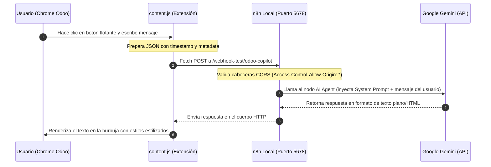
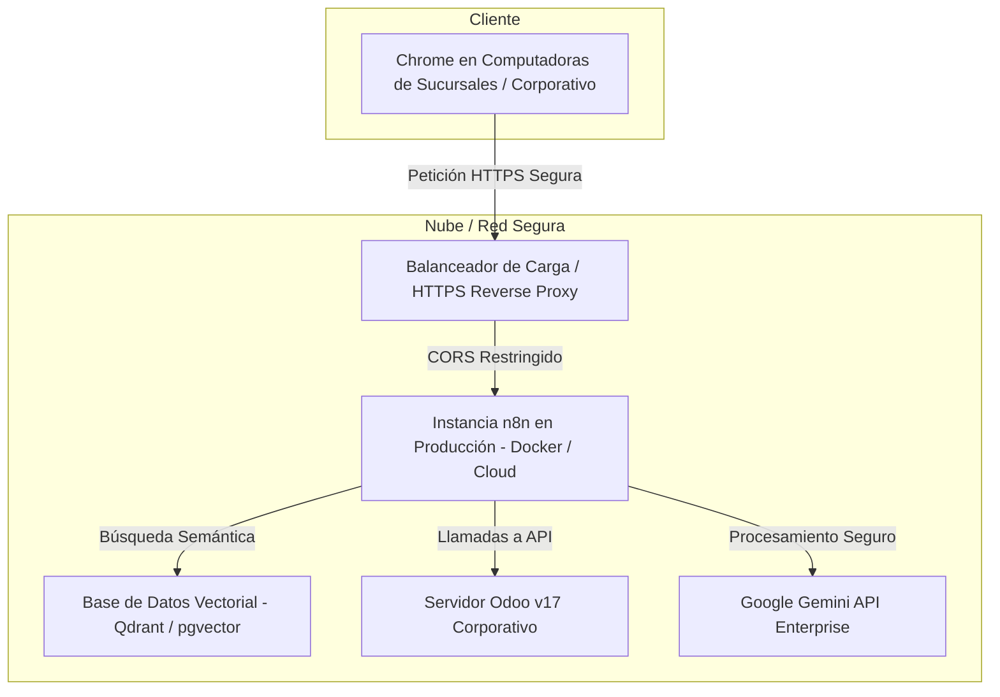

# Manual Técnico y Arquitectura del Proyecto: Agente de IA Flotante para Odoo v17

Este documento detalla el diseño, la estructura de archivos, el flujo de datos y la ruta de despliegue en la nube para el prototipo (PoC) del **Agente de IA Flotante para Odoo v17**, diseñado para integrarse con manuales de Google Drive y herramientas de automatización en n8n.

---

## 1. Descripción General del Proyecto

El proyecto consiste en una extensión de navegador local (Google Chrome) que "flota" sobre la interfaz de Odoo v17 e inyecta un chat interactivo. Este chat actúa como cliente (Frontend) y se conecta a un flujo de trabajo de automatización en n8n (Backend) que contiene un **AI Agent** conectado a la API de **Google Gemini** (Cerebro).

El objetivo es asistir al personal farmacéutico en tres áreas críticas:
1. **Consultoría funcional** sobre Odoo v17 nativo.
2. **Guía interactiva** de procesos internos (RAG con Google Drive).
3. **Automatización de tareas** y consultas a la base de datos (Odoo DB y Google Calendar mediante Tools).

---

## 2. Estructura de Archivos del Proyecto

Los archivos se encuentran en el directorio de trabajo local: `c:\Users\Sist-JPinto\Desktop\Agente IA\`.

```text
Agente IA/
├── manifest.json         # Manifiesto de la extensión de Chrome (Manifest V3)
├── content.js            # Inyecta la burbuja de chat y gestiona la comunicación HTTP con n8n
├── styles.css            # Hoja de estilos del chat (Aislamiento CSS y Glassmorphism)
├── system_prompt.txt     # Reglas de comportamiento y tono del Agente de IA
├── knowledge_base.json   # Datos de prueba locales (procesos, directorio y Odoo)
└── n8n_workflow.json     # Plantilla de importación para el flujo del cerebro en n8n
```

### Detalle de los componentes clave de la extensión:
* **[manifest.json](manifest.json)**: Declara que la extensión corre bajo Manifest V3 y especifica los patrones de URL de Odoo (`localhost:8069`, `*.odoo.com`, `*.odoo.sh`) donde el script debe inyectarse.
* **[content.js](content.js)**: Construye dinámicamente el botón flotante (FAB) y el panel del chat en el DOM de la página activa. Reenvía el texto ingresado por el usuario mediante un `fetch` POST al webhook de n8n, acompañándolo del usuario y del timestamp del sistema de forma transparente.
* **[styles.css](styles.css)**: Aplica una interfaz oscura estilizada (*slate 900*), desenfoque de fondo (*backdrop-filter: blur*), animaciones de apertura/cierre y encapsulamiento bajo el contenedor `#pharmacy-copilot-root` para no romper los estilos nativos de Odoo.

---

## 3. Arquitectura y Flujo de Funcionamiento

El flujo de información es síncrono e integrado de extremo a extremo:



---

## 4. Qué falta por hacer (Pendientes para completar la PoC)

Para llevar este prototipo al alcance completo especificado en tus requerimientos, se deben habilitar las siguientes conexiones en el panel de n8n:

### A. RAG real con Google Drive (Fase 2)
1. **Instalar dependencias de credenciales**: Configurar una credencial de tipo *Google OAuth2* en tu n8n para acceder a los archivos de Google Drive.
2. **Implementar el cargador de documentos**: En el lienzo de n8n, conecta un nodo **`Google Drive Document Loader`** al nodo **`In-Memory Vector Store`**.
3. **Configurar la indexación**: Apunta el cargador al ID de la carpeta de Google Drive que contiene los flujos levantados y documentados. n8n vectorizará la información al vuelo para que el AI Agent la consulte dinámicamente.

### B. Consulta en Tiempo Real de Facturas de Proveedores (Fase 3)
1. **Crear una herramienta en n8n**: En el nodo **`AI Agent`**, conecta un puerto de tipo **Tool** y agrega una **`Custom Tool`** llamada `buscar_factura_odoo`.
2. **Definir el esquema**: Configura la herramienta describiéndole al modelo que la use cuando el usuario pregunte por el estado de una factura (por ejemplo: `PROV-2026-0042`).
3. **Conectar a Odoo**: Dentro de la herramienta, utiliza un nodo **`HTTP Request`** o un nodo personalizado de Odoo en n8n que haga una consulta al módulo de contabilidad de Odoo (`account.move`) mediante la API XML-RPC/JSON-RPC nativa de Odoo v17, filtrando por el nombre de la factura y retornando el campo `state` (`draft`, `posted`, `cancel`) y `payment_state` (`not_paid`, `in_payment`, `paid`).

### C. Automatización de Calendario (Asistente de Productividad)
1. **Crear herramienta de calendario**: Agrega una herramienta llamada `agendar_reunion_calendario` al AI Agent.
2. **Conectar Google Calendar**: Enlaza esta herramienta a un nodo de **`Google Calendar`** configurado para la acción *Create Event*. La IA deducirá del chat el asunto de la reunión, la fecha, la hora de inicio y los correos de los participantes del directorio para agendarlos automáticamente.

---

## 5. Guía de Despliegue en la Nube (Producción / Cloud)

Llevar este prototipo local a un entorno de producción seguro y estable para una cadena de farmacias requiere cambios significativos en infraestructura y seguridad:



### A. Servidor y Alojamiento de n8n
* **Prototipo**: n8n local en puerto `5678`.
* **Nube**: Hospedar n8n en una instancia virtual en la nube (AWS EC2, DigitalOcean Droplet o n8n Cloud oficial). 
* **Despliegue sugerido**: Usar **Docker Compose** en un VPS propio con almacenamiento persistente y un certificado SSL (HTTPS) configurado a través de Nginx o Traefik.

### B. Seguridad, CORS y Dominios (Crítico)
* En la PoC local, el Webhook de n8n tiene configurado `Access-Control-Allow-Origin: *` (permite peticiones desde cualquier sitio). **Esto es sumamente inseguro para producción.**
* **Configuración en producción**: En el nodo Webhook de n8n en la nube, debes restringir el CORS para que **solo** acepte peticiones desde el dominio exacto de tu Odoo corporativo:
  * `Access-Control-Allow-Origin: https://your-company.odoo.com`
* Habilitar HTTPS en n8n. Chrome bloquea llamadas desde páginas seguras (`https://`) a endpoints no seguros (`http://`), por lo que el webhook de n8n debe ser estrictamente `https://n8n.mi-empresa.com`.

### C. Almacenamiento Vectorial Persistente
* **Prototipo**: `In-Memory Vector Store` (los vectores se pierden si se reinicia n8n y deben cargarse de nuevo de Google Drive).
* **Nube**: Conectar n8n a una base de datos vectorial dedicada y persistente como **Qdrant**, **Pinecone** o una base de datos PostgreSQL con la extensión **pgvector**. Esto garantiza búsquedas semánticas ultrarrápidas y persistencia del conocimiento de los flujos de Drive sin re-indexar constantemente.

### D. Distribución Segura de la Extensión de Chrome
* Para que los farmacéuticos y líderes de procesos de la empresa puedan usar la extensión sin tener que habilitar el "Modo Desarrollador" manualmente en cada máquina:
  1. **Chrome Web Store Privada**: Puedes publicar la extensión de forma privada en la Chrome Web Store, restringiendo la visibilidad únicamente a las cuentas de Google Workspace de tu dominio corporativo.
  2. **Políticas de Grupo de Windows (Active Directory)**: En sistemas Windows corporativos, se puede forzar la instalación remota y silenciosa de la extensión utilizando las directivas de grupo administrativas de Chrome Enterprise.

### E. Gobernanza de Datos y Privacidad (HIPAA / Privacidad Médica)
* Dado que es una cadena de farmacias, asegúrate de utilizar los endpoints corporativos o comerciales de la API de Google Gemini (Google Cloud Vertex AI o Gemini API de pago con exclusión de entrenamiento de datos) para garantizar que los datos de las facturas de Odoo y la información del directorio no se utilicen para entrenar modelos públicos de inteligencia artificial.
